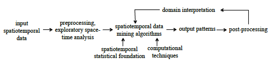

Review recent computational techniques and tools in spatiotempoal datamining 
> Shekhar, Shashi, et al. "Spatiotemporal data mining: a computational perspective." ISPRS International Journal of Geo-Information 4.4 (2015): 2306-2338.

- 공간정보와 시간자료의 폭발적 증가 : spatiotemporal data mining 은 대규모 시공간 데이터베이스에서 잠재적이고 유용한 패턴을 찾는 과정에 대한 연구. 
- the process of spatiotemporal data mining

